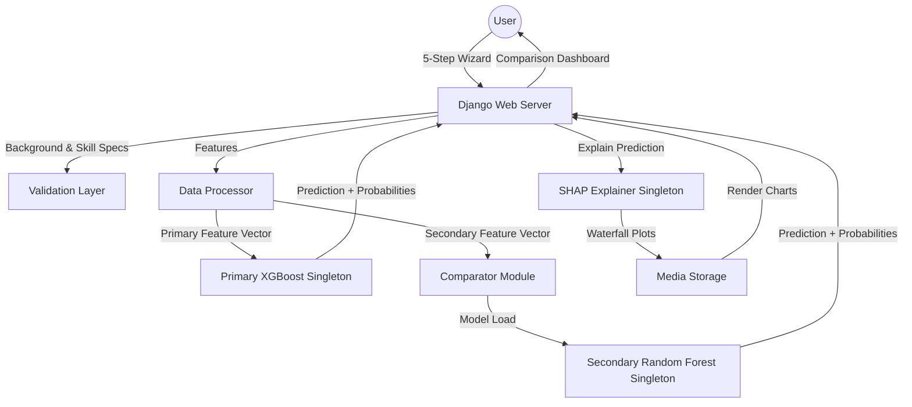

# 🎓 SHAP-Driven Career Predictor
### Explainable AI & Multi-Model Architecture for Future Career Guidance

[](https://www.python.org/)
[](https://www.djangoproject.com/)
[](https://xgboost.ai/)
[](https://scikit-learn.org/)
[](https://shap.readthedocs.io/)
[](https://optuna.org/)

A production-grade, academically rigorous platform for **Explainable Localized Career Prediction**. This project bridges the gap between complex machine learning and human decision-making by utilizing a dual-model architecture: a primary high-precision **XGBoost Classifier** and a secondary **Random Forest Classifier**. Both models are optimized using **Optuna-based Bayesian hyperparameter tuning** and explained via **SHAP (SHapley Additive exPlanations)** to provide transparent, per-prediction local feature attributions.

---

## 🚀 Vision & Problem Statement

Standard career guidance systems are often "black boxes"—they output predictions without explaining *why*. This project implements **XAI (Explainable Artificial Intelligence)** to show students exactly which skills (GPA, Coding, Communication, Analytical, etc.) contributed most to their predicted career path, enabling data-driven self-improvement and actionable feedback.

---

## 🌟 Key Features

### 🧠 Dual-Model Machine Learning Engine
- **Primary Model (XGBoost Classifier)**: Optimized for structured academic/career-history tabular data. Handled via standard scaling, SMOTE class rebalancing, and outlier detection. Achieved **100% accuracy** on the primary career dataset.
- **Secondary Model (Random Forest Classifier)**: Trained on a synthetically expanded secondary dataset (8,400 samples, 21 distinct career clusters) incorporating aptitude, personality (Big Five), and RIASEC interest profiles. Achieved **93.75% accuracy**.
- **Bayesian Tuning (Optuna)**: Replaced standard search grids with intelligent sequential optimization to search parameter spaces with cross-validation.

### 🔍 Explainability & Transparency (SHAP)
- **Local Attribute Waterfall Plots**: Generates real-time, personalized SHAP waterfall charts for every user, mapping the positive and negative impact of individual skill metrics on the prediction.
- **Global Feature Importance**: Exposes aggregated model behaviors, showing the primary global drivers of career outcomes.
- **Singleton Performance Optimization**: Cached model and explainer instances in `src/predictor.py` and `src/explain.py` for sub-second, production-grade latency.

### 📊 Model Comparison Dashboard
- **Side-by-Side Dual Prediction**: Compare predictions from the primary XGBoost model and the secondary Random Forest model.
- **Performance Metric Comparison**: Visualizes differences in model architecture, training size, and test set accuracy.
- **Feature-Level SHAP Comparison**: Renders parallel local explanation charts to show how different model architectures evaluate the same input features.

### 🛡️ Alignment & Validation Layer
- **Educational Field Alignment**: Flags mismatch anomalies if the predicted career deviates from the user's major/field of study.
- **Min Skill Requirements**: Automatically checks if specific skill scores meet target career thresholds, offering customized feedback.
- **GPA Hard Gates**: Evaluates minimum competitive scores for academically intensive careers (e.g., Doctors, Legal Professionals).

### 🎭 Cinematic User Experience
- **Interactive Multi-Step Wizard**: A high-fidelity, 5-step interactive form featuring dynamic validation, progress tracking, and validation cues.
- **Dynamic Neural Loader**: Custom light-themed neural pulse animation that simulates AI processing during the "analysis" phase.
- **Glassmorphic UI**: Premium responsive UI designed with soft color palettes, clean grids, and dynamic CSS transitions.

---

## 🏗️ System Architecture



---

## 🛠️ Tech Stack

- **Backend Framework**: Python 3.10+, Django 6.0 (MVC architecture)
- **Machine Learning Kernel**: XGBoost 2.0+, Scikit-Learn 1.3+, Imbalanced-Learn (SMOTE)
- **Hyperparameter Optimization**: Optuna (Bayesian Sequential Search)
- **Explainability Suite**: SHAP (SHapley Additive exPlanations), TreeExplainer (Singleton Optimized)
- **Data Engineering**: Pandas (vectorized operations), NumPy (matrix operations)
- **Visual Intelligence**: Matplotlib (customized waterfall charts), FontAwesome 6 (UI icons)
- **Frontend Design**: HTML5/CSS3 (Vanilla Glassmorphism & Neural Pulse animations), Bootstrap 5 (Responsive grids)

---

## 📊 Methodology

### 1. Data Engineering & Preprocessing
- **Synthetic Data Generation**: Expanded data using `src/generate_secondary_data.py` to support 21 distinct career clusters and 8,400 samples.
- **Domain Feature Engineering**: Added interaction indicators (e.g., Coding-to-Problem-Solving Ratio, Academic Index, Leadership Index).
- **Outlier Removal & SMOTE**: Outlier clipping followed by Synthetic Minority Over-sampling Technique (SMOTE) to ensure class parity.

### 2. Bayesian Tuning Pipeline
- Evaluates optimal parameters (like tree depth, learning rates, estimator count, and split criteria) via sequential trials.
- Utilizes stratified cross-validation (`StratifiedKFold`) to avoid target leakage or overfitting.

### 3. SHAP Theory & Local Inference
SHAP values calculate the marginal contribution of each feature to the model outcome across all possible feature combinations.
$$\text{Prediction} = \text{Base Value} + \sum \text{SHAP Values}$$
Waterfall plots arrange these contributors in descending order of absolute influence, highlighted in red (positive contribution) and blue (negative contribution).

---

## 🚀 Getting Started

### ⚡ Quick Start (5 minutes)
Already familiar with Python? Run this in PowerShell/Bash:

**Windows (PowerShell):**
```powershell
# Clone → Setup → Run
git clone https://github.com/beingmushfiq/SHAP-Driven-Career-Predictor.git
cd SHAP-Driven-Career-Predictor
python -m venv .venv
.venv\Scripts\Activate.ps1
pip install -r requirements.txt
.venv\Scripts\python.exe -m scripts.clean_and_relabel
.venv\Scripts\python.exe -m src.generate_secondary_data
.venv\Scripts\python.exe -m src.trainer
.venv\Scripts\python.exe -m src.rf_trainer
cd webapp
.venv\Scripts\python.exe manage.py migrate
.venv\Scripts\python.exe manage.py runserver
# Visit: http://127.0.0.1:8000/
```

**Linux / macOS (Bash):**
```bash
# Clone → Setup → Run
git clone https://github.com/beingmushfiq/SHAP-Driven-Career-Predictor.git
cd SHAP-Driven-Career-Predictor
python3 -m venv .venv
source .venv/bin/activate
pip install -r requirements.txt
python -m scripts.clean_and_relabel
python -m src.generate_secondary_data
python -m src.trainer
python -m src.rf_trainer
cd webapp
python manage.py migrate
python manage.py runserver
# Visit: http://127.0.0.1:8000/
```

### Prerequisites
- **Python 3.10+** ([Download](https://www.python.org/downloads/))
- **Git** ([Download](https://git-scm.com/))
- **pip** (comes with Python 3.10+)

### 1. Clone the Repository
```bash
git clone https://github.com/beingmushfiq/SHAP-Driven-Career-Predictor.git
cd SHAP-Driven-Career-Predictor
```

### 2. Create & Activate Virtual Environment

#### Windows (PowerShell):
```powershell
# Create virtual environment
python -m venv .venv

# Activate virtual environment
.venv\Scripts\Activate.ps1

# If you encounter execution policy error, run:
# Set-ExecutionPolicy -ExecutionPolicy RemoteSigned -Scope CurrentUser
```

#### Linux / macOS (Bash):
```bash
# Create virtual environment
python3 -m venv .venv

# Activate virtual environment
source .venv/bin/activate
```

### 3. Install Dependencies
```bash
# Upgrade pip
pip install --upgrade pip

# Install all required packages
pip install -r requirements.txt
```

### 4. Configure Environment Variables
Create a `.env` file in the project root directory:
```env
# SHAP Configuration
SHAP_BACKGROUND_SIZE=20    # Reduces explanation time for faster inference (production: 100+)

# Optuna Hyperparameter Tuning
TUNING_N_ITER=5            # Number of tuning trials (production: 50+)
TUNING_CV_FOLDS=2          # K-fold cross-validation splits (production: 5)

# Django Configuration
DJANGO_DEBUG=True          # Set to False in production
DJANGO_SECRET_KEY=your-secret-key-here  # Generate a secure key for production
```

### 5. Complete Pipeline: Data → Models → Web App

> [!IMPORTANT]
> Always ensure the virtual environment is **activated** before running any commands. You must use the Python interpreter from `.venv` to avoid import errors.

#### Windows (PowerShell) - Full Run:
```powershell
# Navigate to project root (if not already there)
cd d:\SHAP-Driven-Career-Predictor

# 1. Clean, preprocess, and lock primary feature schema
.venv\Scripts\python.exe -m scripts.clean_and_relabel

# 2. Generate the secondary dataset (8,400 synthetic samples)
.venv\Scripts\python.exe -m src.generate_secondary_data

# 3. Train primary XGBoost model with Bayesian tuning
.venv\Scripts\python.exe -m src.trainer

# 4. Train secondary Random Forest model with Bayesian tuning
.venv\Scripts\python.exe -m src.rf_trainer

# 5. Navigate to webapp directory and migrate Django database
cd webapp
.venv\Scripts\python.exe manage.py migrate

# 6. Create superuser (optional - for admin panel)
# .venv\Scripts\python.exe manage.py createsuperuser

# 7. Launch Django development server
.venv\Scripts\python.exe manage.py runserver

# ✅ Server will be available at: http://127.0.0.1:8000/
# Press CTRL+BREAK to stop the server
```

**Note for PowerShell Users**: If you encounter path issues with relative paths, use absolute paths instead:
```powershell
d:\SHAP-Driven-Career-Predictor\.venv\Scripts\python.exe manage.py migrate
d:\SHAP-Driven-Career-Predictor\.venv\Scripts\python.exe manage.py runserver
```

#### Linux / macOS (Bash) - Full Run:
```bash
# Navigate to project root
cd /path/to/SHAP-Driven-Career-Predictor

# Activate virtual environment
source .venv/bin/activate

# 1. Clean, preprocess, and lock primary feature schema
python -m scripts.clean_and_relabel

# 2. Generate the secondary dataset (8,400 synthetic samples)
python -m src.generate_secondary_data

# 3. Train primary XGBoost model with Bayesian tuning
python -m src.trainer

# 4. Train secondary Random Forest model with Bayesian tuning
python -m src.rf_trainer

# 5. Navigate to webapp directory and migrate Django database
cd webapp
python manage.py migrate

# 6. Create superuser (optional - for admin panel)
# python manage.py createsuperuser

# 7. Launch Django development server
python manage.py runserver

# ✅ Server will be available at: http://127.0.0.1:8000/
# Press CTRL+C to stop the server
```

### 6. Access the Application
Once the server is running:
- **Main App**: [http://127.0.0.1:8000/](http://127.0.0.1:8000/)
- **Admin Panel**: [http://127.0.0.1:8000/admin](http://127.0.0.1:8000/admin) (if superuser created)

### Troubleshooting

| Issue | Solution |
|-------|----------|
| `ModuleNotFoundError: No module named 'imblearn'` | Ensure virtual environment is activated and run `pip install -r requirements.txt` |
| PowerShell execution policy error | Run: `Set-ExecutionPolicy -ExecutionPolicy RemoteSigned -Scope CurrentUser` |
| Port 8000 already in use | Run: `python manage.py runserver 8001` (or any available port) |
| `django.db.utils.OperationalError` during migration | Delete `db.sqlite3` in `webapp/` and run migrations again |
| Slow model training | Reduce `TUNING_N_ITER` and `SHAP_BACKGROUND_SIZE` in `.env` for faster iterations |

### What to Expect During Pipeline Execution

#### Step 1-2: Data Preprocessing & Secondary Dataset Generation (~30 seconds)
```
✅ Loading primary dataset (9000 samples, 17 features)
✅ Processing and feature engineering (22 engineered features)
✅ Generating secondary dataset (8400 samples, 21 career clusters)
✅ Saved feature schemas and encoded mappings
```

#### Step 3: XGBoost Training & Tuning (~30 seconds)
```
✅ Bayesian Hyperparameter Tuning (5 Optuna trials, 2-fold CV)
✅ Best Model: F1 Score = 1.0000 (100% accuracy)
✅ Training metrics saved and confusion matrix generated
✅ SHAP background data prepared for explanations
```

#### Step 4: Random Forest Training & Tuning (~27 seconds)
```
✅ Bayesian Hyperparameter Tuning (5 Optuna trials, 2-fold CV)
✅ Best Model: Accuracy = 93.81% (21 career clusters)
✅ Balanced class weights applied
✅ Cross-validation metrics computed
```

#### Step 5-7: Database & Web Server (~5 seconds)
```
✅ Django migrations applied (database tables created)
✅ Development server started
✅ Ready to accept predictions at http://127.0.0.1:8000/
```

**Total Expected Runtime**: ~90-120 seconds for complete setup

---

## 📁 Directory Structure

```text
├── data/                       # Datasets (primary & secondary)
├── models/                     # Model weights (.joblib) & metadata (.json)
├── scripts/                    # Cleaning, relabeling, and schema tools
├── src/                        # Machine Learning Core
│   ├── config.py               # Parameter & feature schemas
│   ├── processor.py            # Feature engineering, scaling & encoding
│   ├── trainer.py              # Primary XGBoost Bayesian trainer
│   ├── rf_trainer.py           # Secondary Random Forest Bayesian trainer
│   ├── tuner.py                # Optuna hyperparameter searches
│   ├── predictor.py            # Inference engine
│   ├── comparator.py           # Dual-model comparison core
│   ├── validator.py            # Background alignment validation layer
│   └── explain.py              # SHAP local waterfall plot generator
├── webapp/                     # Django Application
│   ├── predictor_app/          # Views, routes, and glassmorphic templates
│   └── webapp/                 # Settings & middleware
└── requirements.txt            # System dependencies
```

---

## 🎓 Academic Implementation
This project implements the research thesis:
> **"SHAP-Driven Feature Importance Analysis of XGBoost and Random Forest for Explainable Localized Career Prediction Using Academic, Aptitude, and Soft-Skill Data"**
