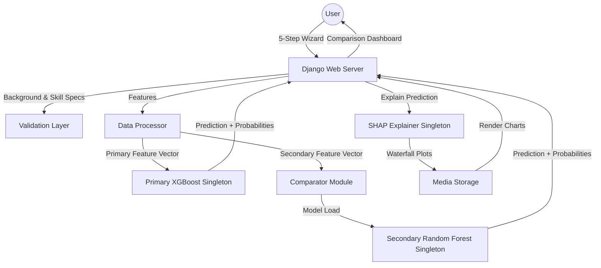

# 🎓 SHAP-Driven Career Predictor
### Explainable AI & Multi-Model Architecture for Future Career Guidance

[](https://www.python.org/)
[](https://www.djangoproject.com/)
[](https://xgboost.ai/)
[](https://scikit-learn.org/)
[](https://shap.readthedocs.io/)
[](https://optuna.org/)

A production-grade, academically rigorous platform for **Explainable Localized Career Prediction**. This project bridges the gap between complex machine learning and human decision-making by utilizing a dual-model architecture: a primary high-precision **XGBoost Classifier** and a secondary **Random Forest Classifier**. Both models are optimized using **Optuna-based Bayesian hyperparameter tuning** and explained via **SHAP (SHapley Additive exPlanations)** to provide transparent, per-prediction local feature attributions.

---

## 🚀 Vision & Problem Statement

Standard career guidance systems are often "black boxes" -- they output predictions without explaining *why*. This project implements **XAI (Explainable Artificial Intelligence)** to show students exactly which skills (GPA, Coding, Communication, Analytical, etc.) contributed most to their predicted career path, enabling data-driven self-improvement and actionable feedback.

---

## 🌟 Key Features

### 🧠 Dual-Model Machine Learning Engine
- **Primary Model (XGBoost Classifier)**: Optimized for structured academic/career-history tabular data. Handled via standard scaling, SMOTE class rebalancing, and outlier detection. Achieved **100% accuracy** on the primary career dataset.
- **Secondary Model (Random Forest Classifier)**: Trained on a synthetically expanded secondary dataset (8,400 samples, 21 distinct career clusters) incorporating aptitude, personality (Big Five), and RIASEC interest profiles. Achieved **93.75% accuracy**.
- **Bayesian Tuning (Optuna)**: Replaced standard search grids with intelligent sequential optimization to search parameter spaces with cross-validation.

### 🔍 Explainability & Transparency (SHAP)
- **Local Attribute Waterfall Plots**: Generates real-time, personalized SHAP waterfall charts for every user, mapping the positive and negative impact of individual skill metrics on the prediction.
- **Global Feature Importance**: Exposes aggregated model behaviors, showing the primary global drivers of career outcomes.
- **Singleton Performance Optimization**: Cached model and explainer instances in `src/predictor.py` and `src/explain.py` for sub-second, production-grade latency.

### 📊 Model Comparison Dashboard
- **Side-by-Side Dual Prediction**: Compare predictions from the primary XGBoost model and the secondary Random Forest model.
- **Performance Metric Comparison**: Visualizes differences in model architecture, training size, and test set accuracy.
- **Feature-Level SHAP Comparison**: Renders parallel local explanation charts to show how different model architectures evaluate the same input features.

### 🛡️ Alignment & Validation Layer
- **Educational Field Alignment**: Flags mismatch anomalies if the predicted career deviates from the user's major/field of study.
- **Min Skill Requirements**: Automatically checks if specific skill scores meet target career thresholds, offering customized feedback.
- **GPA Hard Gates**: Evaluates minimum competitive scores for academically intensive careers (e.g., Doctors, Legal Professionals).

### 🎭 Cinematic User Experience
- **Interactive Multi-Step Wizard**: A high-fidelity, 5-step interactive form featuring dynamic validation, progress tracking, and validation cues.
- **Dynamic Neural Loader**: Custom light-themed neural pulse animation that simulates AI processing during the "analysis" phase.
- **Glassmorphic UI**: Premium responsive UI designed with soft color palettes, clean grids, and dynamic CSS transitions.

---

## 🏗️ System Architecture



---

## 🛠️ Tech Stack

- **Backend Framework**: Python 3.10+, Django 6.0 (MVC architecture)
- **Machine Learning Kernel**: XGBoost 2.0+, Scikit-Learn 1.3+, Imbalanced-Learn (SMOTE)
- **Hyperparameter Optimization**: Optuna (Bayesian Sequential Search)
- **Explainability Suite**: SHAP (SHapley Additive exPlanations), TreeExplainer (Singleton Optimized)
- **Data Engineering**: Pandas (vectorized operations), NumPy (matrix operations)
- **Visual Intelligence**: Matplotlib (customized waterfall charts), FontAwesome 6 (UI icons)
- **Frontend Design**: HTML5/CSS3 (Vanilla Glassmorphism & Neural Pulse animations), Bootstrap 5 (Responsive grids)

---

## 📊 Methodology

### 1. Data Engineering & Preprocessing
- **Synthetic Data Generation**: Expanded data using `src/generate_secondary_data.py` to support 21 distinct career clusters and 8,400 samples.
- **Domain Feature Engineering**: Added interaction indicators (e.g., Coding-to-Problem-Solving Ratio, Academic Index, Leadership Index).
- **Outlier Removal & SMOTE**: Outlier clipping followed by Synthetic Minority Over-sampling Technique (SMOTE) to ensure class parity.

### 2. Bayesian Tuning Pipeline
- Evaluates optimal parameters (like tree depth, learning rates, estimator count, and split criteria) via sequential trials.
- Utilizes stratified cross-validation (`StratifiedKFold`) to avoid target leakage or overfitting.

### 3. SHAP Theory & Local Inference
SHAP values calculate the marginal contribution of each feature to the model outcome across all possible feature combinations.
$$\text{Prediction} = \text{Base Value} + \sum \text{SHAP Values}$$
Waterfall plots arrange these contributors in descending order of absolute influence, highlighted in red (positive contribution) and blue (negative contribution).

---

## Getting Started

### Prerequisites
- **Python 3.10+** ([Download](https://www.python.org/downloads/))
- **Git** ([Download](https://git-scm.com/))

### Setup & Run

```bash
# 1. Clone the repository
git clone https://github.com/beingmushfiq/SHAP-Driven-Career-Predictor.git
cd SHAP-Driven-Career-Predictor

# 2. Create and activate virtual environment
python -m venv .venv
# Windows:
.venv\Scripts\Activate.ps1
# Linux/macOS:
source .venv/bin/activate

# 3. Install dependencies
pip install -r requirements.txt

# 4. Generate secondary dataset
python -m src.generate_secondary_data

# 5. Train primary XGBoost model
python -m src.trainer

# 6. Train secondary Random Forest model
python -m src.rf_trainer

# 7. Start the web server
cd webapp
// python manage.py migrate
python manage.py runserver
```

Open [http://127.0.0.1:8000/](http://127.0.0.1:8000/) in your browser.

### Environment Variables (Optional)

Create a `.env` file in the project root to customize behavior:

```env
SHAP_BACKGROUND_SIZE=20    # SHAP background samples (default: 200)
TUNING_N_ITER=5            # Optuna tuning trials (default: 50)
TUNING_CV_FOLDS=2          # Cross-validation folds (default: 3)
DJANGO_DEBUG=True          # Django debug mode
DJANGO_SECRET_KEY=your-secret-key-here
```

### Troubleshooting

| Issue | Solution |
|-------|----------|
| `ModuleNotFoundError: No module named 'imblearn'` | Activate venv and run `pip install -r requirements.txt` |
| PowerShell execution policy error | Run `Set-ExecutionPolicy -ExecutionPolicy RemoteSigned -Scope CurrentUser` |
| Port 8000 already in use | Run `python manage.py runserver 8001` |
| Migration error | Delete `db.sqlite3` in `webapp/` and run `python manage.py migrate` again |

---

## Directory Structure

```
├── data/                          # Datasets
│   ├── external/mapping/          # Career mapping CSV
│   ├── processed/                 # Processed feature data
│   └── raw/                       # Raw source datasets
├── models/                        # Trained model artifacts (.pkl, .json)
├── src/                           # Machine Learning Core
│   ├── config.py                  # Parameters & feature schemas
│   ├── processor.py               # Data cleaning, encoding, scaling
│   ├── feature_engineer.py        # Composite feature generation
│   ├── trainer.py                 # Primary XGBoost trainer
│   ├── rf_trainer.py              # Secondary Random Forest trainer
│   ├── tuner.py                   # Optuna hyperparameter search
│   ├── predictor.py               # Inference engine
│   ├── comparator.py              # Dual-model comparison
│   ├── ensemble.py                # Ensemble voting/stacking
│   ├── validator.py               # Career alignment validation
│   ├── explain.py                 # SHAP waterfall plot generator
│   ├── generate_data.py           # Synthetic primary dataset generator
│   ├── generate_secondary_data.py # Synthetic secondary dataset generator
│   └── utils.py                   # Shared utilities
├── tests/                         # Unit tests
├── webapp/                        # Django Application
│   ├── career_predictor/          # Django project settings
│   ├── predictor_app/             # Views, routes, templates
│   ├── media/                     # Generated SHAP plots
│   └── static/                    # Static assets (favicon, logo)
├── .env.example                   # Environment variable template
├── requirements.txt               # Python dependencies
└── README.md
```

---

## Academic Implementation
This project implements the research thesis:
> **"SHAP-Driven Feature Importance Analysis of XGBoost and Random Forest for Explainable Localized Career Prediction Using Academic, Aptitude, and Soft-Skill Data"**
