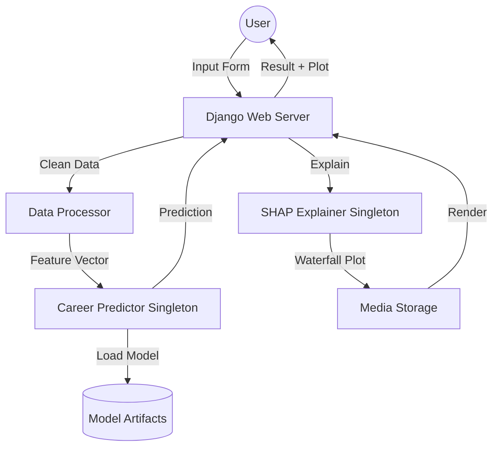

# SHAP-Driven Career Predictor

[](https://www.python.org/)
[](https://www.djangoproject.com/)
[](https://xgboost.ai/)
[](https://shap.readthedocs.io/)

A production-ready, academically rigorous web application for **Explainable Localized Career Prediction**. This platform uses **XGBoost** to analyze academic and soft-skill data and leverages **SHAP (SHapley Additive exPlanations)** to provide transparent, per-prediction insights.

---

## 🌟 Key Features

- **Predictive Intelligence**: High-accuracy XGBoost classifier trained on 17+ localized features.
- **Explainability Layer**: Localized SHAP waterfall plots for every prediction to show feature contribution.
- **Global Insights**: Summary analysis of feature importance across the entire dataset.
- **Production Architecture**: 
    - **Singleton Pattern**: Cached models and explainers for low-latency inference.
    - **Schema Locking**: Ensures data consistency between training and serving.
    - **Modular Pipeline**: Clean separation of data engineering, training, and web serving.
- **Premium UI**: Dark-themed, responsive interface with glassmorphic design.

---

## 🏗️ System Architecture



---

## 🛠️ Tech Stack

- **Backend**: Python 3.14, Django 6.0
- **Machine Learning**: XGBoost, Scikit-Learn, Pandas, NumPy
- **Explainability**: SHAP (TreeExplainer)
- **Visualization**: Matplotlib
- **Frontend**: HTML5, Vanilla CSS (Glassmorphism), Bootstrap 5

---

## 🚀 Getting Started

### 1. Installation
Clone the repository and install the dependencies:
```bash
pip install -r requirements.txt
```

### 2. Prepare Data
Generate the synthetic dataset (or place your own `career_data.csv` in `data/raw/`):
```bash
python -m src.generate_data
```

### 3. Train the Model
Run the end-to-end training pipeline. This will perform hyperparameter tuning and save all necessary artifacts:
```bash
python -m src.trainer
```

### 4. Setup Django
Initialize the database and start the server:
```bash
cd webapp
python manage.py migrate
python manage.py runserver
```

---

## 📊 Methodology

### Data Processing
The `DataProcessor` handles cleaning, missing value imputation (median/mode), and `LabelEncoding`. It saves a `feature_schema.json` to lock the order and types of features, ensuring that the model always receives data in the correct format during inference.

### Explainable AI (SHAP)
We use `shap.TreeExplainer` with a background sample of 200 rows. This allows us to calculate SHAP values efficiently while maintaining academic rigor. The **Waterfall Plot** on the result page shows how much each feature (in log-odds) shifted the prediction away from the average (base) value.

---

## 📁 Directory Structure

```text
├── data/               # Raw and processed datasets
├── models/             # Trained models, encoders, and schema
├── src/                # Core ML pipeline modules
│   ├── processor.py    # Data cleaning & encoding
│   ├── trainer.py      # Model training & tuning
│   ├── predictor.py    # Singleton inference engine
│   └── explain.py      # SHAP explainability layer
├── webapp/             # Django web application
└── tests/              # Unit and integration tests
```

---

## 📜 Academic Reference
This project was developed as a implementation of the thesis:
> **"SHAP-Driven Feature Importance Analysis of XGBoost for Explainable Localized Career Prediction Using Academic and Soft-Skill Data"**

---

## 🤝 Contributing
Contributions are welcome! Please ensure that any changes to the ML pipeline maintain the schema-locking mechanism.

## 📄 License
MIT License - Copyright (c) 2026
