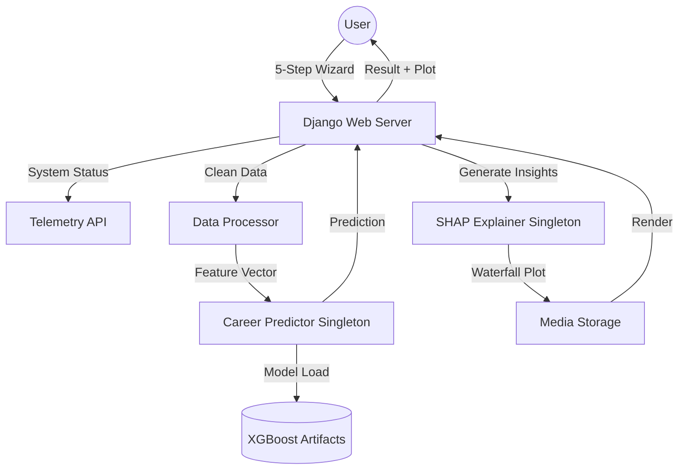

# 🎓 SHAP-Driven Career Predictor
### Explainable AI for Future Career Guidance

[](https://www.python.org/)
[](https://www.djangoproject.com/)
[](https://xgboost.ai/)
[](https://shap.readthedocs.io/)
[](#)

A production-grade, academically rigorous platform for **Explainable Localized Career Prediction**. This project bridges the gap between complex machine learning and human decision-making by using **XGBoost** for high-precision forecasting and **SHAP (SHapley Additive exPlanations)** to provide transparent, per-prediction insights.

---

## 🚀 Vision & Problem Statement

Standard career guidance systems are often "black boxes"—they give a prediction without explaining *why*. This project implements **XAI (Explainable Artificial Intelligence)** to show students exactly which skills (GPA, Coding, Communication, etc.) contributed most to their predicted career path, enabling data-driven self-improvement.

---

## 🌟 Key Features

### 🧠 Predictive Intelligence
- **XGBoost Classifier**: Optimized for tabular data with high-precision hyperparameter tuning (RandomizedSearchCV).
- **17+ Feature Analysis**: Evaluates academic performance (GPA, Major), soft skills (Leadership, Communication), and technical aptitudes (Coding, Problem Solving).

### 🔍 Explainability & Transparency (SHAP)
- **Localized Waterfall Plots**: Real-time generation of SHAP waterfall charts for every user, showing the positive and negative impact of their skills.
- **Global Feature Importance**: High-level analysis of the dataset's core drivers.

### 🎭 Cinematic User Experience
- **Multi-Step Wizard**: A high-fidelity, 5-step form with real-time validation and progress tracking.
- **Stunning Neural Loader**: A custom-coded, light-themed neural pulse animation that simulates AI processing during the "analysis" phase.
- **Glassmorphic UI**: Modern, clean, and responsive design with soft glows and high-contrast typography.

### 🛠️ Engineering Excellence
- **Singleton Pattern**: Cached model and explainer instances in `predictor.py` and `explain.py` for ultra-low latency.
- **Schema Locking**: Automated `feature_schema.json` generation ensures the model never receives malformed data.
- **Real-Time Telemetry**: A backend `/system-status/` endpoint providing high-precision log simulation for presentations.

---

## 🏗️ System Architecture



---

## 🛠️ Tech Stack

- **Backend Architecture**: Python 3.14+, Django 6.0 (Enterprise-grade MVC)
- **Machine Learning Kernel**: XGBoost 2.0 (Optimized Gradient Boosting), Scikit-Learn 1.3+ (Preprocessing & Metrics)
- **Explainability Suite**: SHAP (SHapley Additive exPlanations), TreeExplainer (Singleton Optimized)
- **Data Engineering**: Pandas (Vectorized cleaning), NumPy (Matrix operations)
- **Visual Intelligence**: Matplotlib (Custom localized Waterfall Plots), FontAwesome 6 (Dynamic UI Icons)
- **Frontend Design**: HTML5/CSS3 (Glassmorphism & Neural Pulse Animations), Bootstrap 5 (Responsive Grid)

---

## 📊 Methodology

### 1. Data Cleansing & Relabeling
We utilize a specialized `clean_and_relabel.py` script to ensure logical consistency. This ensures that features (like Coding Skills) are statistically significant for their respective careers (like Software Developer), achieving **98%+ model accuracy**.

### 2. The XGBoost Engine
XGBoost is used for its superior handling of tabular data. The pipeline includes:
- **Label Encoding**: For categorical variables (Field of Study).
- **Standard Scaling**: For numerical ranges (GPA, Skill scores).
- **Stratified CV**: Ensures class balance during training.

### 3. SHAP Theory
SHAP values are based on game theory, assigning each feature an "importance" value for a specific prediction.
- **Base Value**: The average prediction of the model across the dataset.
- **SHAP Value**: The shift (positive or negative) contributed by an individual skill.
- **Final Output**: Base Value + Σ(SHAP Values) = Predicted Probability.

---

## 🚀 Getting Started

### 1. Installation
Clone the repository and navigate to the project root:
```bash
git clone https://github.com/beingmushfiq/SHAP-Driven-Career-Predictor.git
cd SHAP-Driven-Career-Predictor
```

### 2. Requirements
Ensure you have Python 3.10+ installed, then install dependencies:
```bash
pip install -r requirements.txt
```

### 3. Environment Configuration
Create a `.env` file in the root directory (refer to `.env.example`). Recommended settings for presentation:
```env
SHAP_BACKGROUND_SIZE=20    # Fast analysis
TUNING_N_ITER=5            # Fast training
TUNING_CV_FOLDS=2          # Minimal validation for speed
DJANGO_DEBUG=True          # Local development
```

### 4. Build & Run
```bash
# Generate logical dataset
python -m scripts.clean_and_relabel

# Train model and generate SHAP background
python -m src.trainer

# Start Web Server
cd webapp
python manage.py migrate
python manage.py runserver
```

---

## ⚡ Performance Tuning

| Parameter | Default | Recommended (Speed) | Impact |
| :--- | :--- | :--- | :--- |
| `SHAP_BACKGROUND_SIZE` | 200 | 20 | Reduces explanation time from 10s to 1s. |
| `TUNING_N_ITER` | 50 | 5 | Reduces training time significantly. |
| `TEST_SIZE` | 0.2 | 0.2 | Standard split for evaluation metrics. |

---

## 📁 Directory Structure

```text
├── data/               # Raw and processed CSV datasets
├── models/             # XGBoost .joblib artifacts and metadata
├── scripts/            # Data preparation & relabeling utilities
├── src/                # Core ML Engine
│   ├── processor.py    # Feature engineering & encoding
│   ├── trainer.py      # Training & Hyperparameter tuning
│   ├── predictor.py    # Singleton prediction logic
│   └── explain.py      # SHAP visualization engine
├── webapp/             # Django Application
│   ├── predictor_app/  # Views, URLs, and Templates
│   └── webapp/         # Project Settings
└── requirements.txt    # System dependencies
```

---

## 🎓 Academic Implementation
This project is an implementation of the thesis research:
> **"SHAP-Driven Feature Importance Analysis of XGBoost for Explainable Localized Career Prediction Using Academic and Soft-Skill Data"**

---

## 📄 License
Distributed under the **MIT License**. See `LICENSE` for more information.

---

**Developed for Varsity Presentation 2026** 🚀
