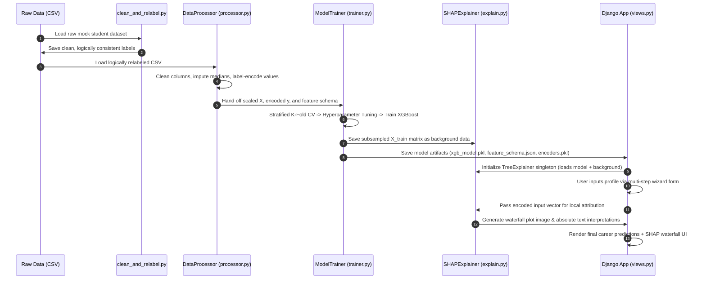

# 🎓 Kaggle Adaptation Guide & Technical Audit
## SHAP-Driven Career Predictor

This document provides a comprehensive technical audit of the **SHAP-Driven Career Predictor** codebase and a step-by-step roadmap for running, training, and serving the machine learning pipeline and the Django web application within the **Kaggle Notebook** environment.

---

## A. Project Overview

The **SHAP-Driven Career Predictor** is an Explainable AI (XAI) application that predicts student career paths based on a blend of 17 academic metrics, soft skills, and technical capabilities. It uses:
1. **XGBoost** as its high-performance gradient boosting engine.
2. **SHAP (SHapley Additive exPlanations)** to provide mathematical local/global feature attribution (explaining *why* a prediction was made).
3. **Django** as the web interface displaying a 5-step wizard, interactive waterfall plots, and simulated telemetry logs.

---

## B. Repository Structure Breakdown

Below is the complete tree representing the repository structure:

```text
SHAP-Driven-Career-Predictor/
├── .env                              # Local environment variables
├── .env.example                      # Template for env variables
├── README.md                         # Main project documentation
├── requirements.txt                  # Python dependencies
├── data/                             # Dataset storage
│   ├── raw/
│   │   ├── career_dataset_student.csv          # Original student records (60 KB)
│   │   └── career_dataset_student_original.csv # Backup of raw data
│   ├── processed/
│   │   └── processed_data.csv                  # Standardized and encoded data
│   └── external/                               # External dataset holds
├── models/                           # Model artifacts & metadata (Generated)
│   ├── feature_schema.json           # Immutably locked feature order
│   ├── label_encoders.pkl            # Encoders for input features
│   ├── target_encoder.pkl            # Encoder for career targets
│   ├── xgb_model.pkl                 # Trained XGBoost binary model (42 MB)
│   ├── shap_background.npy           # Subsampled training data for SHAP reference
│   └── metadata.json                 # Training timestamps and validation metrics
├── scripts/                          # Relabeling and validation tools
│   └── clean_and_relabel.py          # Enforces logical correlation to data
├── src/                              # Machine Learning Pipeline Kernel
│   ├── __init__.py
│   ├── config.py                     # Centralized settings & path configuration
│   ├── processor.py                  # End-to-end cleaning, scaling, and encoding
│   ├── trainer.py                    # Hyperparameter tuning (CV) & training
│   ├── predictor.py                  # Inference Engine Singleton
│   ├── explain.py                    # SHAP tree-explainability and plot generator
│   └── utils.py                      # Thread-safe logging, seed setting, hashes
├── tests/                            # Unit test suites
│   ├── test_predictor.py
│   └── test_processor.py
└── webapp/                           # Django Web Application Interface
    ├── db.sqlite3                    # Local SQLite database state
    ├── manage.py                     # Django entrypoint
    ├── career_predictor/             # Django project settings
    │   ├── settings.py
    │   ├── urls.py
    │   └── wsgi.py
    └── predictor_app/                # Django Application Views & Templates
        ├── forms.py                  # Prediction multi-select form definitions
        ├── templates/                # Glassmorphic HTML templates
        ├── views.py                  # Handles predictions, status & SHAP visualization
        └── urls.py                   # App-specific routes
```

### Core Files and Their Purpose
*   [config.py](file:///d:/SHAP-Driven-Career-Predictor/src/config.py): Manages paths, numerical thresholds, categories, hyperparameters, and logging variables using environment settings.
*   [processor.py](file:///d:/SHAP-Driven-Career-Predictor/src/processor.py): Loads raw data, cleans strings, handles missing data, encodes values via `LabelEncoder`, and writes `feature_schema.json` to freeze input columns.
*   [trainer.py](file:///d:/SHAP-Driven-Career-Predictor/src/trainer.py): Runs randomized grid search CV, fits the XGBoost model, evaluates metrics (precision, recall, weighted F1), saves confusion matrices, and extracts SHAP background samples.
*   [explain.py](file:///d:/SHAP-Driven-Career-Predictor/src/explain.py): Core explainability engine. Caches `shap.TreeExplainer` in a singleton class and creates Matplotlib-based waterfall plots.
*   [predictor.py](file:///d:/SHAP-Driven-Career-Predictor/src/predictor.py): Serves model predictions, scales numerical classes, and implements a prediction-sharpening function.
*   [clean_and_relabel.py](file:///d:/SHAP-Driven-Career-Predictor/scripts/clean_and_relabel.py): Modifies the mock raw student data to inject logical feature-target pairings (e.g., boosting CS students' coding skills) so that the classifier can converge correctly.

---

## C. Project Execution Flow

Below is the operational flow of the application from raw data ingestion to user prediction:



---

## D. Dependency Analysis

### Required Dependencies
The original `requirements.txt` includes:
```text
numpy>=2.1.0
pandas>=2.0.0
scikit-learn>=1.3.0
xgboost>=2.0.0
shap>=0.43.0
django>=5.0
matplotlib>=3.8.0
joblib>=1.3.0
python-dotenv>=1.0.10
scipy>=1.10.0
```

### Kaggle Environment Compatibility & Conflicts
*   **SHAP & Numpy 2.x Compatibility**: SHAP binary wheels can experience issues compiled against Numpy 2.x in certain environments. In Kaggle, we enforce a highly stable, compatible setup by pinning `numpy<2.0.0` and upgrading `shap` if needed to prevent segmentation faults during C++ tree operations.
*   **Django & Headless Serving**: Django is included. While Kaggle is primarily a batch processing environment, we can launch Django inside a background thread and expose it using a public reverse proxy tunnel (`pyngrok` or `localtunnel`).

---

## E. Kaggle Environment Compatibility Issues

| Issue | Why It Breaks in Kaggle | Exact Fix |
|:---|:---|:---|
| **Hardcoded/Relative Paths** | Relative paths like `Path('data/raw/...')` fail depending on the active notebook directory context. | Use `Config.PROJECT_ROOT` explicitly and set the working directory to `/kaggle/working`. |
| **Write Permissions** | Kaggle mounts input datasets under `/kaggle/input/` as **read-only** mount points. | Copy raw datasets to `/kaggle/working/data/raw/` before executing the pipeline. |
| **Django UI Exposing** | Kaggle runs in a secure, containerized private network. IP binding to `localhost:8000` is inaccessible. | Install `pyngrok` and run a background tunnel pointing to port `8000` to access the application UI. |
| **Matplotlib GUI Errors** | Rendering plots on headless machines throws `tkinter` errors if non-interactive backends aren't set. | Keep `matplotlib.use('Agg')` active (which is already configured in the code). |

---

## F. Required Modifications

To run seamlessly inside Kaggle, you only need to write a wrapper setup script/cell that handles folder structures, copies files, and launches the tasks.

### 1. File Path Normalization
Ensure the project root behaves correctly inside the notebook using:
```python
import os
os.environ['PROJECT_ROOT'] = '/kaggle/working'
```

### 2. Read-Only Data Mocking
Since Kaggle directories outside of `/kaggle/working` are read-only, run a shell command to initialize the project folder layout:
```bash
mkdir -p /kaggle/working/data/raw /kaggle/working/data/processed /kaggle/working/models /kaggle/working/logs
```

---

## G. Kaggle Notebook Setup

Create a Kaggle notebook and construct the following setup cells.

### Cell 1: Environment Variables & Portability Settings
```python
import os
import sys
from pathlib import Path

# Override environment variables to align with Kaggle's working directory
os.environ['PROJECT_ROOT'] = '/kaggle/working'
os.environ['DATA_RAW_DIR'] = 'data/raw'
os.environ['DATA_PROCESSED_DIR'] = 'data/processed'
os.environ['MODELS_DIR'] = 'models'
os.environ['MEDIA_DIR'] = 'webapp/media'

# Add working directory to Python path
sys.path.append('/kaggle/working')

print("Kaggle Environment Configured.")
```

### Cell 2: Install Target Dependencies
```bash
%%bash
# Upgrade standard libraries to versions matching the project specification
pip install --quiet "numpy<2.0.0" pandas scikit-learn xgboost shap django matplotlib joblib python-dotenv scipy pyngrok
```

### Cell 3: Directory Structuring
```python
# Create required directory trees
from src.config import Config
Config.ensure_directories()
print("Pipeline folders generated.")
```

---

## H. Step-by-Step Execution Guide

### STEP 1: Setting up the Dataset
Upload your raw CSV to Kaggle:
1. Click **+ Add Data** in the top right corner of the Kaggle Notebook Editor.
2. Select **Upload a dataset** -> Name it `student-career-dataset`.
3. Upload `career_dataset_student.csv`.
4. Run this cell to copy the uploaded dataset to the writeable directory:
```python
import shutil

# Copy dataset to raw path
source_path = '/kaggle/input/student-career-dataset/career_dataset_student.csv'
dest_path = '/kaggle/working/data/raw/career_dataset_student.csv'

shutil.copy(source_path, dest_path)
print("Dataset imported successfully.")
```

### STEP 2: Running Clean & Relabel Pipeline
```python
from scripts.clean_and_relabel import clean_and_relabel
clean_and_relabel()
```

### STEP 3: Model Training, Hyperparameter Tuning & SHAP Calculations
```python
from src.trainer import ModelTrainer

# Initialize trainer
trainer = ModelTrainer()

# Execute complete pipeline (CV Search, Training, Evaluator, Matrix Plot, and SHAP background setup)
model = trainer.run_pipeline()
```

### STEP 4: Expose Django UI via Tunnel (Optional)
If you wish to view the Django application live:
1. Sign up for a free account at [ngrok.com](https://ngrok.com/) and copy your Authtoken.
2. Run the cell below, supplying your Authtoken to establish a secure reverse proxy:
```python
from pyngrok import ngrok
import subprocess
import time

# Set authtoken (Replace with your actual Ngrok token)
NGROK_AUTHTOKEN = "YOUR_NGROK_AUTHTOKEN_HERE"
ngrok.set_auth_token(NGROK_AUTHTOKEN)

# Open tunnel on port 8000
public_url = ngrok.connect(8000)
print(f"★ DJANGO WEB APP RUNNING AT: {public_url} ★")

# Run migrations
subprocess.Popen(["python", "webapp/manage.py", "migrate"], cwd="/kaggle/working")
time.sleep(3)

# Launch Django Web Server
django_process = subprocess.Popen(
    ["python", "webapp/manage.py", "runserver", "0.0.0.0:8000", "--noreload"],
    cwd="/kaggle/working"
)
```

---

## I. Expected Errors & Fixes

### 1. `FileNotFoundError` during model load
*   **Why**: The pipeline wasn't executed or the path was resolved outside `/kaggle/working`.
*   **Fix**: Set `os.environ['PROJECT_ROOT'] = '/kaggle/working'` at the top of the notebook before importing custom modules.

### 2. `ValueError` on SHAP visualization
*   **Why**: Explainer expects input vectors with a matching feature dimension.
*   **Fix**: `feature_schema.json` locks column order. Always preprocess single instances using `predictor.preprocess_input()`.

---

## J. Performance Optimization

*   **SHAP Background Size**: Keep `SHAP_BACKGROUND_SIZE=20` (in your `.env` or configurations) to calculate attribution maps in under 2 seconds.
*   **Grid Search Iterations**: Limit `TUNING_N_ITER=5` and `TUNING_CV_FOLDS=2` in notebooks to avoid runtime limits.
