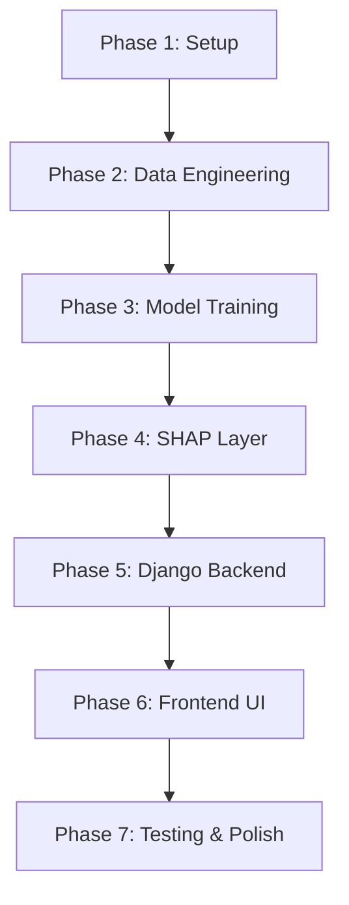

# 📋 Task Breakdown: SHAP-Driven Career Prediction System

## Task Execution Order & Dependencies



---

## Phase 1: Project Setup & Configuration
> **Goal**: Establish project structure, dependencies, and configuration

### Task 1.1 — Create Project Directory Structure
- **Action**: Create all directories as defined in the architecture
- **Deliverables**: Full directory tree with `__init__.py` files
- **Acceptance**: All directories exist, Python packages importable

### Task 1.2 — Create `requirements.txt`
- **Action**: Pin all dependencies
- **Deliverables**: `requirements.txt` with:
  ```
  numpy==2.1.0
  pandas>=2.0.0
  scikit-learn>=1.3.0
  xgboost>=2.0.0
  shap>=0.43.0
  django>=5.0
  matplotlib>=3.8.0
  joblib>=1.3.0
  python-dotenv>=1.0.0
  gunicorn>=21.2.0
  ```
- **Acceptance**: `pip install -r requirements.txt` succeeds

### Task 1.3 — Create `src/config.py`
- **Action**: Centralized path and configuration management
- **Deliverables**: Config class with all paths, random seeds, hyperparameter defaults
- **Key Design**: Use `os.environ.get()` with sensible defaults, `pathlib.Path` for all paths
- **Acceptance**: All modules import config without circular dependencies

### Task 1.4 — Create `src/utils.py`
- **Action**: Logging setup, helper functions
- **Deliverables**: `get_logger()` function, `set_seeds()`, `ensure_dir()` helpers
- **Acceptance**: Logger outputs to both console and file

### Task 1.5 — Create `.env.example` and `.gitignore`
- **Action**: Template environment file, proper gitignore
- **Deliverables**: `.env.example` with all configurable vars, `.gitignore` excluding data/models/media
- **Acceptance**: Sensitive files excluded from VCS

---

## Phase 2: Data Engineering Pipeline
> **Goal**: Build robust, reusable data processing pipeline

### Task 2.1 — Create Synthetic/Sample Dataset
- **Action**: Generate a representative career prediction dataset with 17 features and career labels
- **Deliverables**: `data/raw/career_data.csv` with 500+ rows
- **Features**: Mix of numerical (1–10 scales) and categorical (Yes/No, named categories)
- **Target**: `career_label` with 8–12 distinct career categories
- **Acceptance**: Dataset loads, all columns present, no trivial patterns

### Task 2.2 — Implement `src/processor.py`
- **Action**: Full data processing pipeline
- **Deliverables**: `DataProcessor` class with methods:
  - `load_data(path)` → raw DataFrame
  - `clean_data(df)` → cleaned DataFrame
  - `encode_features(df)` → encoded DataFrame + saved encoders
  - `scale_features(df)` → scaled DataFrame + saved scaler
  - `create_schema(df)` → `feature_schema.json`
  - `prepare_for_training(df)` → X, y split
  - `process_pipeline(path)` → full end-to-end pipeline
- **Key Rules**:
  - Feature order locked after first training
  - Encoders saved individually per feature
  - Imputation strategy logged explicitly
  - Schema validation on every load
- **Acceptance**: Pipeline runs end-to-end, encoders saved, schema locked

### Task 2.3 — Validate Processor Output
- **Action**: Verify encoded data integrity
- **Checks**:
  - No NaN in output
  - All features are numeric
  - Feature order matches schema
  - Encoder can reverse-transform
  - Target distribution is reasonable
- **Acceptance**: All checks pass

---

## Phase 3: Model Training Pipeline
> **Goal**: Train, tune, evaluate, and persist XGBoost model

### Task 3.1 — Implement `src/trainer.py`
- **Action**: Complete training pipeline
- **Deliverables**: `ModelTrainer` class with methods:
  - `split_data(X, y)` → stratified train/test split
  - `build_model()` → base XGBoost classifier
  - `tune_hyperparameters(X_train, y_train)` → best params via RandomizedSearchCV
  - `train(X_train, y_train, params)` → fitted model
  - `evaluate(model, X_test, y_test)` → metrics dict
  - `save_model(model, metrics)` → persist all artifacts
  - `generate_confusion_matrix(y_true, y_pred)` → saved plot
  - `run_pipeline()` → full training run
- **Key Decisions**:
  - 50 iterations RandomizedSearchCV
  - 5-fold StratifiedKFold
  - Scoring: `f1_weighted`
  - Background sample (200 rows) saved for SHAP
- **Acceptance**: Model trained, metrics > 70% accuracy, all artifacts saved

### Task 3.2 — Create `metadata.json` Schema
- **Action**: Define and save training metadata
- **Contents**:
  ```json
  {
    "version": "1.0.0",
    "trained_at": "ISO-8601 timestamp",
    "python_version": "3.x.x",
    "xgboost_version": "x.x.x",
    "n_samples": 500,
    "n_features": 17,
    "n_classes": 10,
    "class_labels": ["Developer", "Designer", ...],
    "feature_names": ["logical_quotient", ...],
    "best_params": { ... },
    "metrics": {
      "accuracy": 0.85,
      "f1_weighted": 0.84,
      "precision_weighted": 0.85,
      "recall_weighted": 0.84
    },
    "training_data_hash": "sha256:...",
    "random_seed": 42
  }
  ```
- **Acceptance**: JSON is valid, all fields populated

### Task 3.3 — Run Training and Verify Artifacts
- **Action**: Execute full training pipeline
- **Verify**:
  - `models/xgb_model.pkl` exists and loadable
  - `models/label_encoders.pkl` contains all encoders
  - `models/shap_background.npy` is shape (200, n_features)
  - `models/feature_schema.json` has correct feature order
  - `models/metadata.json` has all metrics
- **Acceptance**: All files present, model predicts correctly on test data

---

## Phase 4: SHAP Explainability Layer
> **Goal**: Build cached, efficient SHAP explanation system

### Task 4.1 — Implement `src/explain.py`
- **Action**: SHAP explainability module
- **Deliverables**: `SHAPExplainer` class (singleton pattern) with:
  - `__init__()` → load model, background, create TreeExplainer (lazy)
  - `get_explainer()` → cached SHAP TreeExplainer
  - `compute_shap_values(X)` → SHAP values array
  - `global_summary_plot()` → save summary bar plot to media/
  - `local_waterfall_plot(X_single, prediction_id)` → save waterfall to media/
  - `feature_importance_comparison()` → XGBoost vs SHAP comparison plot
- **Key Design**:
  - Singleton: only one explainer instance in memory
  - Background: loaded from `shap_background.npy`
  - Plots: matplotlib with tight_layout, proper titles, DPI=150
  - Thread-safe plot generation (use `matplotlib.use('Agg')`)
- **Acceptance**: Both global and local plots generate correctly

### Task 4.2 — Generate Global Analysis Plots
- **Action**: Pre-generate global SHAP analysis
- **Deliverables**:
  - `media/shap_plots/global_summary.png` — SHAP summary bar plot
  - `media/shap_plots/feature_comparison.png` — XGBoost vs SHAP importance
  - `media/shap_plots/soft_vs_academic.png` — Category-level analysis
- **Acceptance**: All 3 plots saved, visually clear, properly labeled

---

## Phase 5: Django Backend
> **Goal**: Build serving layer with form validation and prediction pipeline

### Task 5.1 — Initialize Django Project
- **Action**: Create Django project and app
- **Commands**:
  ```
  django-admin startproject career_predictor webapp/
  python manage.py startapp predictor_app
  ```
- **Configure**: settings.py with STATIC, MEDIA, TEMPLATES paths
- **Acceptance**: `python manage.py runserver` starts without errors

### Task 5.2 — Implement `src/predictor.py`
- **Action**: Inference pipeline (standalone from training)
- **Deliverables**: `CareerPredictor` class with:
  - `__init__()` → load model, encoders, schema (lazy)
  - `preprocess_input(form_data: dict)` → encoded feature vector
  - `predict(form_data: dict)` → (career_label, probabilities)
  - `get_top_predictions(form_data, n=3)` → top-N predictions with confidence
- **Key Design**:
  - Singleton pattern (one model in memory)
  - Schema validation on every input
  - Unknown category handling (map to most frequent or raise)
  - Returns decoded career label (not numeric)
- **Acceptance**: Predicts correctly for valid input, raises clear errors for invalid

### Task 5.3 — Implement `webapp/predictor_app/forms.py`
- **Action**: Django form with all 17 input fields
- **Deliverables**: `CareerPredictionForm` with:
  - Integer fields with `MinValueValidator`/`MaxValueValidator` for scales
  - `ChoiceField` for all categoricals with defined option lists
  - Custom `clean_*` methods for cross-validation
  - Helpful `help_text` and `widget` attributes
- **Acceptance**: Form rejects invalid input, shows clear error messages

### Task 5.4 — Implement `webapp/predictor_app/views.py`
- **Action**: View logic for all pages
- **Deliverables**:
  - `IndexView` — render landing page
  - `PredictView` — GET: render form, POST: validate → predict → redirect to result
  - `ResultView` — render prediction + SHAP plot
  - `AnalysisView` — render global SHAP analysis
  - `AboutView` — render project info
- **Error Handling**: Try/except around prediction, graceful error page
- **Acceptance**: Full request cycle works end-to-end

### Task 5.5 — Implement `webapp/predictor_app/urls.py`
- **Action**: URL routing
- **Deliverables**: URL patterns for all 5 views
- **Acceptance**: All URLs resolve correctly

### Task 5.6 — Configure Django Settings
- **Action**: Finalize settings for dev and basic prod
- **Configure**:
  - `STATIC_URL`, `STATICFILES_DIRS`
  - `MEDIA_URL`, `MEDIA_ROOT`
  - `TEMPLATES` dirs
  - Logging config
  - `ALLOWED_HOSTS`
- **Acceptance**: Static files serve, media uploads work

---

## Phase 6: Frontend UI
> **Goal**: Build premium, responsive UI with glassmorphic dark theme

### Task 6.1 — Create `base.html` Template
- **Action**: Base layout with navigation, footer, Google Fonts
- **Design**:
  - Dark theme (`#0a0a1a` background, `#e0e0ff` text)
  - Inter font family
  - Glass-morphic navbar with blur effect
  - Smooth page transitions
  - Responsive sidebar/hamburger on mobile
- **Acceptance**: Base template renders, navigation works

### Task 6.2 — Create `index.html` Landing Page
- **Action**: Hero section with project overview
- **Design**:
  - Animated gradient hero background
  - Feature cards with hover effects
  - Call-to-action button to prediction form
  - Statistics section (model accuracy, features used, etc.)
- **Acceptance**: Visually impressive, responsive, all links work

### Task 6.3 — Create `predict.html` Input Form
- **Action**: Styled prediction form
- **Design**:
  - Grouped inputs (Academic, Soft Skills, Preferences)
  - Custom styled select boxes and range inputs
  - Real-time validation feedback
  - Animated submit button with loading state
  - Glass-morphic form cards
- **Acceptance**: All 17 fields render, validation works, submits correctly

### Task 6.4 — Create `result.html` Prediction Result
- **Action**: Result display with SHAP visualization
- **Design**:
  - Prominent career prediction display with confidence score
  - Top-3 predictions with probability bars
  - Embedded SHAP waterfall plot
  - "How this prediction was made" explanation section
  - "Try Again" button
- **Acceptance**: Prediction displayed, SHAP plot visible, responsive

### Task 6.5 — Create `global_analysis.html`
- **Action**: Global SHAP analysis page
- **Design**:
  - SHAP summary plot (large, centered)
  - XGBoost vs SHAP comparison chart
  - Feature category breakdown (soft skills vs academic)
  - Text interpretation of findings
- **Acceptance**: All 3 plots render, interpretations displayed

### Task 6.6 — Create CSS Design System
- **Action**: `static/predictor_app/css/style.css`
- **Deliverables**: Complete design system with:
  - CSS custom properties (colors, spacing, typography)
  - Dark theme palette
  - Glass-morphism utilities
  - Form styling
  - Card components
  - Responsive breakpoints
  - Animations and transitions
  - Button variants
- **Acceptance**: Consistent design across all pages

### Task 6.7 — Add JavaScript Interactivity
- **Action**: `static/predictor_app/js/main.js`
- **Deliverables**:
  - Form validation feedback
  - Loading spinner on submit
  - Smooth scroll navigation
  - Mobile menu toggle
  - Animated number counters (stats section)
- **Acceptance**: Interactive elements work without errors

---

## Phase 7: Testing, Polish & Documentation
> **Goal**: Ensure quality, write tests, finalize documentation

### Task 7.1 — Write Unit Tests
- **Action**: `tests/test_processor.py` and `tests/test_predictor.py`
- **Test Cases**:
  - Processor handles missing values correctly
  - Processor encodes all categorical features
  - Schema lock prevents feature reordering
  - Predictor returns valid career label
  - Predictor handles edge case inputs
  - Predictor raises on invalid feature count
- **Acceptance**: All tests pass

### Task 7.2 — Write Integration Test
- **Action**: `tests/test_integration.py`
- **Test Cases**:
  - POST to `/predict/` with valid data → 302 redirect to result
  - GET `/result/<uuid>/` → 200 with prediction text
  - POST to `/predict/` with invalid data → form errors shown
  - GET `/analysis/` → 200 with images
- **Acceptance**: All integration tests pass

### Task 7.3 — Final Polish & README
- **Action**: Create comprehensive README.md
- **Contents**:
  - Project title and description
  - Architecture diagram
  - Setup instructions
  - Training instructions
  - Running the web app
  - API documentation
  - Screenshots
  - Academic references
- **Acceptance**: New developer can set up and run the project from README alone

### Task 7.4 — End-to-End Verification
- **Action**: Full manual test
- **Checklist**:
  - [ ] `pip install -r requirements.txt` works
  - [ ] Training pipeline runs without errors
  - [ ] All model artifacts are saved
  - [ ] Django server starts
  - [ ] Landing page loads with styling
  - [ ] Form page renders all 17 fields
  - [ ] Valid submission produces prediction
  - [ ] SHAP waterfall plot appears on result page
  - [ ] Global analysis page shows all 3 plots
  - [ ] Invalid input shows proper errors
  - [ ] Mobile responsive layout works
  - [ ] No console errors in browser
- **Acceptance**: All checks pass

---

## Estimated Task Summary

| Phase | Tasks | Critical Path? |
|-------|-------|---------------|
| 1. Setup | 5 tasks | ✅ Yes |
| 2. Data Engineering | 3 tasks | ✅ Yes |
| 3. Model Training | 3 tasks | ✅ Yes |
| 4. SHAP Layer | 2 tasks | ✅ Yes |
| 5. Django Backend | 6 tasks | ✅ Yes |
| 6. Frontend UI | 7 tasks | ✅ Yes |
| 7. Testing & Polish | 4 tasks | No (parallelizable) |
| **Total** | **30 tasks** | |

---

> [!IMPORTANT]
> **Execution Order**: Phases 1–4 must be strictly sequential (each depends on the previous). Phase 5 and 6 can overlap slightly. Phase 7 runs after 6 is complete.

> [!NOTE]
> **Dataset Dependency**: Phase 2 requires a dataset in `data/raw/`. Task 2.1 creates a synthetic dataset if none is provided. If you have a real dataset, place it there before starting Phase 2.
